# Resido - Property & Community Management SaaS Platform

Resido is an enterprise-grade, high-throughput, multi-tenant SaaS platform built for gated communities, apartment complexes, housing societies, and property management associations. It consolidates resident management, security gatepass logs, billing ledgers, helpdesk tickets, parking assignments, and professional service marketplaces into a unified, high-concurrency ecosystem.

The system is built as a highly optimized, decoupled monorepo containing **11 NestJS microservices** (backend), a **React Native mobile app (Expo SDK 51)**, and **React-Vite web dashboards** for admins.

---

## 🏗 Architecture & Consolidated 3-Database Strategy

To maximize throughput, minimize infrastructure costs, and enforce strict tenant data boundaries, Resido utilizes a **Consolidated 3-Database Architecture** on AWS RDS:

```mermaid
graph TD
    ClientApp[Mobile & Web Clients] -->|REST & WebSockets| EdgeGateway[API Gateway :3000]
    
    subgraph Microservices [Backend Microservices NestJS]
        EdgeGateway --> AuthSvc[Auth Service :3001]
        EdgeGateway --> ResSvc[Resident Service :3002]
        EdgeGateway --> BizSvc[Business Service :3005]
        EdgeGateway --> VisitorSvc[Visitor Service :3006]
        EdgeGateway --> ChatSvc[Chat Service :3004]
        EdgeGateway --> ComplSvc[Complaint Service :3007]
        EdgeGateway --> AccSvc[Accounting Service :3003]
        EdgeGateway --> FTSvc[FlaredThread Service :3008]
        EdgeGateway --> NotifSvc[Notification Service]
        
        FTSvc -->|Enqueues Job| BullMQ[Redis BullMQ]
        BullMQ --> MediaWorker[Media Worker Transcoder]
    end

    subgraph DatabaseLayer [AWS RDS PostgreSQL Cluster]
        AuthSvc --> MasterDB[(Master DB: resido_master)]
        AuthSvc --> UserDB[(User DB: resido_users)]
        
        ResSvc -->|Write Queries| CoreDB_Write[(Core DB Write Primary)]
        BizSvc & VisitorSvc & ChatSvc & ComplSvc & AccSvc & FTSvc -->|Write Queries| CoreDB_Write
        
        ResSvc -->|Read Queries| CoreDB_Read[(Core DB Read Replica)]
        BizSvc & VisitorSvc & ChatSvc & ComplSvc & AccSvc & FTSvc -->|Read Queries| CoreDB_Read
    end

    subgraph CacheLayer [AWS ElastiCache Redis]
        EdgeGateway -.->|JWT Cache| RedisMem[In-Memory JWT Cache]
        BizSvc -.->|Category Caching| RedisCache[Redis Shared Cache]
        ChatSvc -.->|Socket.io PubSub| RedisPubSub[Redis WS Adapter]
    end
```



### 1. Master DB (`resido_master`)
* **Role**: System-level configuration, SaaS subscriptions, tenant registrations, township license registries, and admin staff credentials.
* **Scope**: Read and written exclusively by `auth-service` via `@resido/master-client`.

### 2. User DB (`resido_users`)
* **Role**: Global identity registry (mobile phone, email), user preferences, OTP logs, follow/social graph relationships, personal financial trackers, and notes/document sharing spaces.
* **Scope**: Shared/managed primarily by `auth-service` via `@resido/user-client` with indexing optimized for lookups.

### 3. Core DB (`resido_core`)
* **Role**: Operational township data (apartments, units, notices, transactions, amenities, chat rooms, complaints, visitor logs, and local listings).
* **Scope**: Logically partitioned by `tenantId` (representing a gated community).
* **Owner**: `resident-service` acts as the schema owner (`prisma/schema.prisma`). All other core-connected services use subset schemas for data reading and writing, avoiding conflict.

---

## 📂 Complete Monorepo Directory Profile

```bash
resido/
├── apps/                         # NestJS Backend Services
│   ├── api-gateway/              # Edge gateway: JWT decode cache, Keep-Alive proxy, streaming
│   ├── auth-service/             # Global identities, SMS OTP validation, profile uploads, S3 presigned URLs
│   ├── resident-service/         # Township structure, Notice board, amenities booking, core schema owner
│   ├── business-service/         # Local business directory, service categories catalog, Redis caching
│   ├── visitor-service/          # Security gatepass validation, QR code check-ins, manual logs
│   ├── chat-service/             # Real-time WebSocket communications, conversation rooms, Redis pubsub
│   ├── complaint-service/        # Maintenance ticketing workflow (Open -> In Progress -> Resolved -> Closed)
│   ├── accounting-service/       # Resident financial ledger, transactions, and monthly reports
│   ├── flaredthread-service/     # Flares (vertical video loops) and Threads (posts) feed engine
│   ├── media-worker/             # FFMPEG media transcoder (HLS, DASH, thumbnails)
│   └── notification-service/     # Push notification broker, SMS and email triggers
├── libs/                         # Shared libraries
│   └── infra/                    # S3/R2 clients, DB connection pools, common guards, custom decorators
├── web/                          # Web applications (Vite + React)
│   ├── admin/                    # Township Managers / Property Owners dashboard
│   └── superadmin/               # SaaS super-admin billing, Township configuration, licensing console
├── mobile/                       # Mobile Applications
│   └── resido-app/               # React Native App (Expo SDK 51, TypeScript)
│       ├── src/
│       │   ├── components/       # UI elements (AdaptiveVideoPlayer, dashboards, fields)
│       │   ├── screens/          # Application views (Flares, Invoices, Parking, Gatepass, Chats)
│       │   ├── hooks/            # Custom hooks (Video Prefetch, Chat notifications)
│       │   ├── services/         # API clients (React Query endpoints, Storage, WebSockets)
│       │   ├── store/            # State management (authStore, chatStore)
│       │   └── utils/            # Video disk caching, UI formatters
│       └── app/                  # File-based routing (Expo Router)
└── infra/                        # Infrastructure Configuration
    ├── docker-compose.yml        # Multi-container local orchestration script
    ├── ecs/                      # AWS Ecs Task definitions & ALB configs
    └── nginx/                    # Reverse-Proxy routing and SSL configurations
```

---

## 🚀 Service-Based Details

Each microservice is designed to operate statelessly, allowing horizontal scaling behind load balancers. Below are the operational profiles of each service:

| Port | Service | Database Connections | Critical Middleware & Operations |
|---|---|---|---|
| `:3000` | **API Gateway** | None | HTTP Keep-Alive Agent connection pool (`PROXY_MAX_SOCKETS` default: `256`); Gzip response compression; Edge JWT caching; Zero-buffer Node.js streaming pipe forwarding. |
| `:3001` | **Auth Service** | `resido_master`, `resido_users` | OTP logic; S3/Cloudflare R2 presigned URL generation; Social relationship graph updates; User search. |
| `:3002` | **Resident Service** | `resido_core` (Owner) | Aggregates notices, township structures, and amenities. Performs database push migrations on container boot. |
| `:3005` | **Business Service** | `resido_core` (Subset) | Gathers local business directory search suggestions; Caches categories in Redis cluster for 5 minutes. |
| `:3006` | **Visitor Service** | `resido_core` (Subset) | Validates Guest QR Code Gatepasses, logs guard-driven check-ins, and generates visitor registries. |
| `:3004` | **Chat Service** | `resido_core` (Subset) | Drives real-time Socket.IO chat servers with Redis Adapters for multi-container message broadcasting. |
| `:3007` | **Complaint Service**| `resido_core` (Subset) | Tracks complaint tickets raised by residents, assigned staff rosters, and resolution lifecycles. |
| `:3003` | **Accounting Service**| `resido_core` (Subset) | Handles maintenance billing calculation loops, transaction ledgers, and cash/payment reconciliations. |
| `:3008` | **FlaredThread Service**| `resido_core` (Subset) | Operates cursor-paginated feeds, social post visibility checks, and enqueues BullMQ media jobs. |
| *N/A* | **Media Worker** | None | Consumes BullMQ transcoder queue. Runs ffmpeg ladders (1080p, 720p, 480p) to export HLS/DASH. |
| *N/A* | **Notification Svc** | `resido_notifications` | Delivers FCM push tokens, SMS campaigns, and email updates. |

---

## 🗄 Consolidated Database Schema Reference

Below is the structured relational outline of the tables and indices across the three databases:

### 1. Master DB (`resido_master`)
* **`clients`**: Registry of community tenants. Includes `dbName` (schema identifier), `isActive`, `plan` (`BASIC`, `STANDARD`, `PREMIUM`), `slug` (unique URI domain prefix), and `s3Prefix` (folder root).
* **`staff_accounts`**: Accounts for township admin staff. Linked to `clients` via `clientId`. Handles RBAC (`APARTMENT_ADMIN`, `ADMIN_STAFF`, `CARETAKER`).

### 2. User DB (`resido_users`)
* **`users`**: Global identity registry.
  * *Indexes*: Trigram GIN indexes (`gin_trgm_ops`) on `name` and `profileName` for $O(1)$ search lookups.
  * *Columns*: Identity details, visibility preferences (`profileVisibility` enum: `GLOBAL`, `CONTACTS`, `COMMUNITY`, `FOLLOWERS`), visibility on contact fields (`phoneVisibility`), and business profiling bridges (`linkBusinessProfile`).
* **`follow_requests`**: Pending connection request log (`requesterId` -> `targetId`).
* **`follows`**: Bidirectional accepted relationships. Composite index on `[followingId, createdAt(sort: Desc)]` and `[followerId, createdAt(sort: Desc)]` to support sorted feeds.
* **`job_profiles`**: Professional service provider cards (Electricians, Plumbers, etc.) mapping reach type (`ServiceAreaType` enum: `PINCODE`, `DISTRICT`, `STATE`, `PAN_INDIA`).
* **`workspace_memberships`**: Maps global users (`userId`) to a township membership (`memberId` inside a specific `tenantId`).
* **`otp_logs`**: 4-digit mobile verification timestamps.
* **`note_folders`, `note_pages`, `note_shares`**: Personal note vault synced to user cloud storage.
* **`document_folders`, `document_files`, `document_shares`**: Document cabinets with S3 file paths.

### 3. Core DB (`resido_core` - Logically Partitioned by `tenantId`)
* **`apartments`**: The root township metadata.
* **`blocks`**: Tower blocks or housing clusters (foreign key: `apartmentId`).
* **`units`**: Individual flats containing square-footage markers for maintenance billing calculation.
* **`members`**: Unified occupant profiles. Tracks role enums (`APARTMENT_ADMIN`, `RESIDENT`, `SECURITY_STAFF`, `CLEANING_STAFF`, etc.) and `familyId` references.
* **`families`**: Groups residents of the same household (foreign key: `unitId`).
* **`departments` / `department_members`**: Groups staff into operational nodes (e.g. Cleaning Team, Security Guard Room).
* **`complaints`**: Ticketing details including assigned staff, category, status (`OPEN`, `IN_PROGRESS`, `RESOLVED`, `CLOSED`), and array of S3 proof keys.
* **`amenities` / `amenity_bookings`**: Shared township resources (Clubhouses, Gyms) with scheduling configurations and confirmation slots.
* **`community_transactions`**: Financial cash ledger detailing transaction direction (`TransactionType` enum: `INCOME`, `EXPENSE`), category, and date.
* **`maintenance_configs`**: Formula parameters for running community billing. Calculation options: `FLAT_RATE` (static value) or `AREA_BASED` (calculated against apartment sq. ft.).
* **`maintenance_bills`**: The ledger invoice generated for each flat. Status flow: `UNPAID` -> `PENDING_VERIFICATION` (proof uploaded) -> `PAID` (approved by admin).
* **`reminders`**: Automated notification broadcasts.
* **`blogs`**: Thread posts supporting media attachment keys, visibility constraints, likes, and comment paths.
* **`notices`**: Public notices published by administrative personnel.
* **`doc_folders`, `doc_files`, `doc_permissions`**: Shares files inside the gated intranet.
* **`visitors`**: Digital gatepasses containing pre-authorized CUID entries.
* **`visitor_entries`**: Real-time physical guard book recording entry and exit times.
* **`community_assets`**: Asset register (machinery, lifts) detailing depreciation, maintenance schedule, and repair cost.
* **`business_profiles`**: Public services listings owned by a member. Linkable to personal profiles.

---

## ⚡ Fast-Loading & High-Throughput Techniques

To achieve instant loading times comparable to platforms like Instagram or TikTok, Resido integrates several specific optimizations:

### 1. Zero-Buffer API Gateway Streaming
Proxied binary assets, PDFs, and media are piped chunk-by-chunk using Node.js stream pipes in `apps/api-gateway/src/modules/proxy/proxy.controller.ts`:
```ts
response.setHeader('Content-Type', targetResponse.headers['content-type']);
response.setHeader('Content-Length', targetResponse.headers['content-length']);
targetResponse.data.pipe(response);
```
This avoids loading file buffers into memory, protecting the gateway from Out-Of-Memory (OOM) crashes when multiple users load PDFs or media.

### 2. Database Read/Write Splitting
Services separate database connection pools using Prisma. Operational read queries route directly to read replicas, preserving the primary database for write transactions:
```ts
this.client = new PrismaClient({ datasourceUrl: writeUrl });
this.reader = new PrismaClient({ datasourceUrl: readUrl });
```
This prevents reads from blocking writes during high-traffic events like maintenance billing runs.

### 3. Edge JWT Caching
To avoid decoding overhead on parallel dashboard requests, the API Gateway caches signature validations in memory with a 10-second Time-To-Live (TTL). This reduces CPU load under concurrent request bursts.

### 4. Shared Redis Category Caching
Category configurations and business directory listings are cached in Redis for 5 minutes, protecting PostgreSQL from repeated queries during directory searches.

### 5. Direct-to-R2 Presigned Uploads
Large media uploads (Flares/Videos) bypass backend application servers entirely. The mobile client requests a cryptographically signed URL, then uploads the binary payload directly to Cloudflare R2:
```text
Mobile Client ── 1. GET Presigned URL ──▶ Auth Service
Mobile Client ◀── 2. Presigned S3 URL ─── Auth Service
Mobile Client ── 3. PUT File Binary ────▶ Cloudflare R2 Storage
```

### 6. Mobile List Virtualization
Feed views, chat lists, and notice logs use customized `FlatList` components with window constraints:
```tsx
initialNumToRender={5}
maxToRenderPerBatch={10}
windowSize={5}
removeClippedSubviews={true}
```
This maintains smooth performance (60/120 FPS) by limiting off-screen memory usage.

### 7. Client-Side Video Disk Caching
A cache utility (`expo-file-system`) intercepts remote video URLs. If a video has been played before, it reads directly from local storage:
```text
Video Request ──▶ Cache Manager ──[Exists?]── Yes ──▶ Local Disk Path
                                 └── No ───▶ Download & Cache ──▶ Local Disk Path
```

### 8. Look-Ahead Video Prefetching
To reduce playback latency in the Flares vertical video feed, a prefetching hook preloads adjacent videos in the background:
```ts
// Preloads the next 2 videos in the queue while the current video plays
const prefetchQueue = playlist.slice(currentIndex + 1, currentIndex + 3);
prefetchQueue.forEach(item => videoCache.prefetch(item.url));
```

### 9. Local Query Cache Sync
Real-time Socket.IO notifications dynamically patch the local React Query cache, reflecting new messages instantly without requiring full network refreshes:
```ts
queryClient.setQueriesData({ queryKey: ['chats'] }, (oldData) => {
  return patchIncomingMessage(oldData, newMessage);
});
```

---

## 📊 Database Performance Optimizations

### 1. Trigram Indexing for Fast Text Search
To avoid full-table sequential scans on user directories, the PostgreSQL `pg_trgm` extension is enabled. Trigram GIN indexes back query searches:
```prisma
model User {
  id          String   @id @default(cuid())
  name        String?
  profileName String?  @unique
  
  @@index([name(ops: raw("gin_trgm_ops"))], type: Gin)
  @@index([profileName(ops: raw("gin_trgm_ops"))], type: Gin)
}
```

### 2. Elimination of JSON Write Amplification
Historical arrays (such as invoices, parking allocations, and billing configurations) are structured as dedicated relational tables rather than JSON columns. This prevents row locking and rewrite overhead during database updates.

---

## 📱 Core Mobile Features & Workflows

### 1. Gated Visitor QR Gatepass
* **Resident Flow**: Enters guest details, expected time, and vehicle number. Generates a unique QR code which can be shared via WhatsApp.
* **Security Flow**: Opens the scanner screen, scans the QR code, verifies resident details, and approves entry. This action automatically logs an entry in the Visitor Register.

### 2. Maintenance Billing
* **Generation**: Admins input config variables and generate monthly bills in batches of 1,000 using cursor pagination.
* **Payment**: Residents upload transaction screenshots. The bill status updates to `PENDING_VERIFICATION`.
* **Verification**: Admins review the screenshot and approve (setting status to `PAID` and updating the ledger) or reject.

### 3. Community Parking Leases
* **Resident Parking**: Assigned to specific apartment units.
* **Guest Parking**: Leased in 4-hour slots. The system marks expired slots as `FREED` dynamically.
* **Security View**: Searches active parking assignments by plate number or slot ID.

### 4. Gated Profiles & Social Graph
* **Visibility Toggles**: Users control profile visibility (`GLOBAL`, `CONTACTS`, `COMMUNITY`, `FOLLOWERS`).
* **Cross-Linking**: If `linkBusinessProfile` is enabled, the public profile links directly to the user's business listing. If the personal profile is restricted, it renders a locked state with a follow request prompt while keeping the business profile accessible.

---

## 🛠 Local Development & Deployment Guide

### Prerequisites
* Node.js 18+ (with npm workspaces configured)
* Docker & Docker Compose
* PostgreSQL 15+ (with `pg_trgm` and `postgis` extensions)
* Redis Cluster

### 1. Initial Setup
1. Copy the example environment template:
   ```bash
   cp .env.example .env
   ```
2. Install monorepo dependencies:
   ```bash
   npm install
   ```
3. Run the Prisma schema synchronization script (bridges auth-service schemas):
   ```bash
   bash infra/sync-prisma-schemas.sh
   ```

### 2. Local Startup (Docker Compose)
1. Build the microservices:
   ```bash
   npm run build:all
   ```
2. Start the local infrastructure:
   ```bash
   cd infra
   docker compose up -d --build
   ```

---

## 📱 EAS Cross-Platform Build Guide (iOS / Android)

The React Native mobile app is built with **Expo SDK 51**, avoiding native folder lock-in. It supports building for both Android and iOS without code changes.

### 1. Local Development Server
Launch the Expo bundler:
```bash
cd mobile/resido-app
npx expo start
```
Press `a` to run on an Android emulator or `i` to run on an iOS simulator.

### 2. Generating Android Production APK
Run the Expo Application Services (EAS) build for Android:
```bash
eas build --platform android --profile production
```
*Note: This generates a signed `.apk` file for distribution or play-store listing.*

### 3. Generating iOS App Store Build
Ensure you have an active Apple Developer Team configuration, then build for iOS:
```bash
eas build --platform ios --profile production
```
This runs the Xcode compilation pipeline within the EAS cloud container, exporting an `.ipa` file.

---

## 📡 GitHub Actions CI/CD Pipeline

Resido has a modular CI/CD pipeline built with GitHub Actions located in `.github/workflows/`. It is designed to safely handle multi-tenant deployments, microservice matrix builds, and schema migrations.

### Pipeline Orchestration
The primary entry point is the **Release** pipeline (`release.yml`), manually triggered from the Actions tab for **dev** or **prod**. It chains four stages in order:

1. **Terraform Apply (`terraform-apply.yml`)** — optional (`run_terraform=true` on first deploy): VPC, RDS, Redis, ECS, Secrets Manager, ALB. Use **Terraform Plan** (`terraform.yml`) to preview first.
2. **Database Migration (`db-migrate.yml`)** — `prisma migrate deploy` via one-off ECS tasks (builds auth/notification/chat images first). Creates logical DBs + tables. Never `db push`.
3. **Build & Push (`build-and-push.yml`)** — builds all 9 service images (parallel matrix) and pushes to ECR.
4. **Rolling Deployment (`deploy.yml`)** — registers task definitions and updates ECS services.

### Deployment Prerequisites

See **[`.github/GITHUB_ENVIRONMENT_VARIABLES.md`](.github/GITHUB_ENVIRONMENT_VARIABLES.md)** for the full GitHub Environment setup (`dev` and `prod`): 2 secrets, 9 variables, bootstrap order, and IAM permissions.

* **ECR Repositories**: Created by Terraform on first apply.
* **AWS Secrets Manager**: Terraform creates all keys with `REPLACE_ME_*` placeholders; update operator secrets after first apply.
* **Prisma DB Baselining**: Baseline migrations are committed in-repo (`0_init` per DB).
* **IAM Permissions**: Pipeline user needs ECR/ECS access; Terraform stage needs additional infra permissions.

---

## 📄 License

Internal Proprietary Software. © 2026 Resido Tech. All Rights Reserved.

