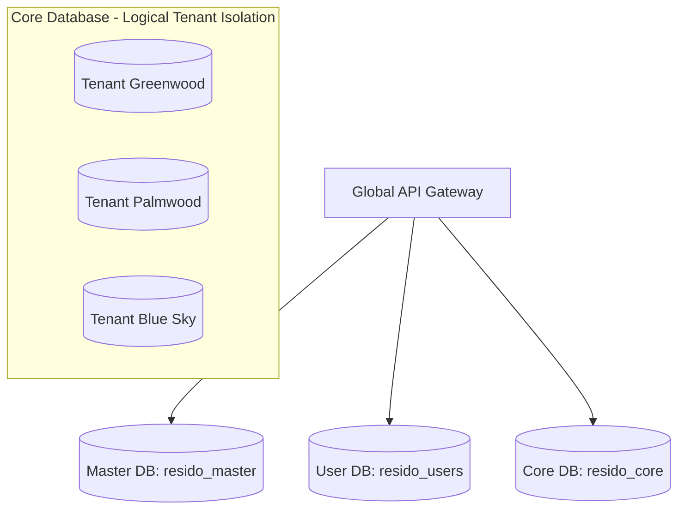

# Resido - Database Architecture & Table Reference

Resido uses a **Consolidated Multi-Tenant Architecture** to scale database operations efficiently while maintaining strict security boundaries, high performance, and rapid tenant provisioning.

---

## 🗄 Consolidated 3-Database Strategy

To eliminate cost overheads and resource fragmentation, Resido consolidates operational and geospatial data into three logically isolated AWS RDS PostgreSQL databases:

### 1. Master DB (`resido_master`)
* **Purpose**: Coordinates community registrations, licensing billing plans, and global township system access.
* **Tables**: `communities`, `subscription_plans`, `tenant_registries`.

### 2. User DB (`resido_users`)
* **Purpose**: Centralizes global identities, cross-community credentials, role profiles, and mobile verification logs.
* **Tables**: `users`, `otp_logs`, `global_profiles`, `user_sessions`.

### 3. Core DB (`resido_core`)
* **Purpose**: Houses all operational community records (Residents, Staff, Finance, Assets, Complaints, Documents, etc.) in a highly structured, unified schema using strict logical tenant isolation (`tenantId`).
* **Tables**: See the table index below.

---

## 📊 Core Database Table Index (`resido_core`)

All community-level features query the unified Core database. Below is the complete schema dictionary for all **28 core tables** managed by Prisma:

### 🏢 Community Structure

#### `apartments`
Stores the high-level residential apartment complexes or townships.
* **Columns**:
  * `id` (`String`, Primary Key, CUID)
  * `tenantId` (`String` - Tenant identifier)
  * `name` (`String` - Complex name)
  * `address` (`String` - Full physical address)
  * `createdAt` (`DateTime`)
  * `updatedAt` (`DateTime`)

#### `blocks`
Groups residential units within an apartment complex.
* **Columns**:
  * `id` (`String`, Primary Key)
  * `tenantId` (`String`)
  * `name` (`String` - e.g., "Block A", "Tower B")
  * `apartmentId` (`String`, Foreign Key pointing to `apartments.id`)

#### `units`
Represents individual household units/flats.
* **Columns**:
  * `id` (`String`, Primary Key)
  * `tenantId` (`String`)
  * `number` (`String` - Flat number, e.g., "302")
  * `floor` (`Int` - Floor level)
  * `blockId` (`String`, Foreign Key pointing to `blocks.id`)

---

### 👥 Occupants, Staff & RBAC

#### `members`
The unified occupant registry. Stores both residents and diverse staff roles.
* **Columns**:
  * `id` (`String`, Primary Key)
  * `tenantId` (`String`)
  * `userId` (`String?` - Optional foreign reference to Global User Identity in User DB)
  * `name` (`String`)
  * `phone` (`String`)
  * `email` (`String?`)
  * `role` (`MemberRole` Enum: `APARTMENT_ADMIN`, `RESIDENT`, `SECURITY_STAFF`, `CLEANING_STAFF`, `MAINTENANCE_STAFF`, `ACCOUNTS_STAFF`, `CARETAKER`, `ADMIN_STAFF`)
  * `profilePhoto` (`String?` - S3 file key)
  * `occupancyType` (`OccupancyType` Enum: `RESIDENT`, `RENTAL`)
  * `isActive` (`Boolean` - Active status)
  * `address` (`String?`)
  * `familyId` (`String?`, Foreign Key pointing to `families.id`)

#### `families`
Groups residents living inside the same unit.
* **Columns**:
  * `id` (`String`, Primary Key)
  * `tenantId` (`String`)
  * `name` (`String` - e.g., "Sharma Family")
  * `unitId` (`String`, Foreign Key pointing to `units.id`)

#### `departments` & `department_members`
Segments staff and residents into functional service groups (e.g. Security Department, Cleaning Team).
* **`departments`**: `id`, `tenantId`, `name`, `type` (`DepartmentType` Enum).
* **`department_members`**: Link table mapping `departmentId` to `memberId`.

---

### 🛠️ Helpdesk & Complaints Dispatch

#### `complaints`
The ticket system for community-wide and unit-specific issues.
* **Columns**:
  * `id` (`String`, Primary Key)
  * `tenantId` (`String`)
  * `title` (`String` - Heading of issue)
  * `description` (`String`)
  * `category` (`String` - Plumbing, Electrical, lift, etc.)
  * `priority` (`Priority` Enum: `LOW`, `MEDIUM`, `HIGH`, `URGENT`)
  * `status` (`ComplaintStatus` Enum: `OPEN`, `IN_PROGRESS`, `RESOLVED`, `CLOSED`)
  * `memberId` (`String` - Resident who raised it)
  * `assignedTo` (`String?` - Member ID of assigned staff)
  * `mediaUrls` (`String[]` - Photo proof keys)
  * `createdAt` / `updatedAt` (`DateTime`)

---

### 📅 Resource Reservation & Amenities

#### `amenities`
Shared resources open for residents to reserve.
* **Columns**:
  * `id` (`String`, Primary Key)
  * `tenantId` (`String`)
  * `name` (`String` - Club house, Gym, Swimming Pool)
  * `description` (`String?`)
  * `photoUrl` (`String?`)
  * `maxPersons` (`Int`)
  * `timeSlots` (`String[]` - Pre-calculated booking intervals)
  * `availableDates` (`String[]` - Custom open booking dates)
  * `scheduleType` (`String` - `WEEKLY`, `MONTHLY`, or `CUSTOM`)
  * `scheduleConfig` (`String?` - Serialized JSON weekly/monthly config blocks)
  * `allowRecurringBookings` (`Boolean`)

#### `amenity_bookings`
Logged amenity reservations.
* **Columns**:
  * `id` (`String`, Primary Key)
  * `tenantId` (`String`)
  * `amenityId` (`String`, Foreign Key)
  * `memberId` (`String`, Foreign Key)
  * `bookingDate` (`String` - YYYY-MM-DD)
  * `timeSlot` (`String` - e.g., "14:00-15:00")
  * `persons` (`Int`)
  * `status` (`String` - `CONFIRMED`, `CANCELLED`)
  * `isRecurring` (`Boolean`)
  * `recurringPeriod` (`String?` - `WEEKLY`, `MONTHLY`)
  * `parentBookingId` (`String?` - Identifies recurring chains)

---

### 💳 Financial Ledger & Billings

#### `community_transactions`
The official ledger records for the township.
* **Columns**:
  * `id` (`String`, Primary Key)
  * `tenantId` (`String`)
  * `amount` (`Float`)
  * `type` (`TransactionType` Enum: `INCOME`, `EXPENSE`)
  * `category` (`String` - Maintenance Fee, Staff Salary, Electricity, Repairs)
  * `date` (`DateTime`)
  * `paymentMethod` (`String` - `CASH`, `UPI`, `CARD`, `BANK_TRANSFER`)
  * `addedById` (`String` - Admin member ID who recorded it)
  * `maintenanceBillId` (`String?` - Links direct payment proof entries)

#### `maintenance_configs`
The formulas and schedules used for generating recurring bills.
* **Columns**:
  * `id` (`String`, Primary Key)
  * `tenantId` (`String`, Unique)
  * `billingCycle` (`BillingCycle` Enum: `MONTHLY`, `QUARTERLY`, `ANNUALLY`)
  * `calculationType` (`CalculationType` Enum: `FLAT_RATE`, `AREA_BASED`)
  * `flatRateAmount` (`Float`)
  * `dueDateDay` (`Int` - Late penalty trigger date)
  * `penaltyAmount` (`Float`)

#### `maintenance_bills`
The active billing ledger for each resident flat.
* **Columns**:
  * `id` (`String`, Primary Key)
  * `tenantId` (`String`)
  * `unitId` (`String`, Foreign Key)
  * `month` / `year` (`Int`)
  * `baseAmount` (`Float`)
  * `otherCharges` (`Float` - Parking, security fee)
  * `penaltyAmount` (`Float` - Late fee penalty)
  * `totalAmount` (`Float` - Sum total dues)
  * `status` (`BillStatus` Enum: `UNPAID`, `PENDING_VERIFICATION`, `PAID`, `OVERDUE`)
  * `receiptUrl` (`String?` - S3 uploaded receipt scan)
  * `description` (`String?` - Payment note)

---

### 🔔 Broadcasts, Forums & Reminders

#### `reminders`
Automated scheduled message broadcaster.
* **Columns**:
  * `id` (`String`, Primary Key)
  * `tenantId` (`String`)
  * `title` / `message` (`String`)
  * `category` (`String` - `MAINTENANCE`, `DUTY_ROSTER`, `EVENT`, `GENERAL`)
  * `targetType` (`String` - `ALL`, `SPECIFIC_UNITS`, `STAFF_ROLE`, `SPECIFIC_MEMBERS`)
  * `targetRoles` (`String[]` - Badged roles targeted)
  * `scheduledAt` (`DateTime?` - Future trigger stamp)
  * `status` (`String` - `PENDING`, `SENT`, `FAILED`)
  * `recurrence` (`String` - `ONCE`, `WEEKLY`, `MONTHLY`)
  * `recurrenceDetail` (`Int?` - Day of week or day of month)

#### `blogs` & `blog_polls`
Resident community feed, flares, and discussion threads.
* **`blogs`**: Thread posts with fields for likes, reshares, hashtags, music attachments, and global visibility configs.
* **`blog_polls`**: Embed polls in community feed threads.

#### `notices`
Official Notice Board announcements posted by administrators.
* **Columns**:
  * `id`, `tenantId`, `title`, `body`, `postedBy` (Member ID), `sendWhatsApp` (Flag).

---

### 📂 File, Document & Security Log Management

#### `doc_folders` / `doc_files`
Community document center with S3 backing.
* **`doc_folders`**: Logical folders containing files with color codes and custom ownership.
* **`doc_files`**: S3 link files detailing name, size, type, and parent folder path.
* **`doc_permissions`**: Flexible ACL mapping folder/file permissions to specific groups or residents (`accessLevel` enum: `OWNER`, `EDITOR`, `VIEWER`).

#### `visitors` / `visitor_entries`
Real-time security logs for gated entrance verification.
* **`visitors`**: Digital gatepasses generated by residents (`passCode`, `purpose`, `vehicleNumber`, `status`).
* **`visitor_entries`**: Strict entry/exit physical logbook recorded by the gate security guard, with camera photo uploads.

#### `community_assets`
Inventories, machines, and physical properties owned by the township.
* **Columns**:
  * `id`, `tenantId`, `name`, `category`, `status` (`ACTIVE`, `MAINTENANCE`, `BROKEN`), `purchaseCost`, `warrantyExpiry`, `billUrl` (R2/S3 receipt link).

#### `business_profiles` / `business_services`
Local business listings and in-complex job profiles (e.g. plumber, babysitter) containing pricing grids, radius maps, and working hours.

---

## 🔒 Tenant Isolation & Safety Rules

Every table containing operational data contains a **`tenantId`** field. The API Gateway and services enforce tenant safety by utilizing the following rules:

1. **Explicit Filters**: Every Prisma transaction must filter by `tenantId`.
2. **Global Middlewares**: Requests from mobile or web pass `x-db-name` headers, which map directly to `tenantId`.
3. **No Cross-Tenancy**: Database pushes or alters are strictly managed by `auth-service` using the unified master schema. Never run `npx prisma db push` on individual service schemas.
